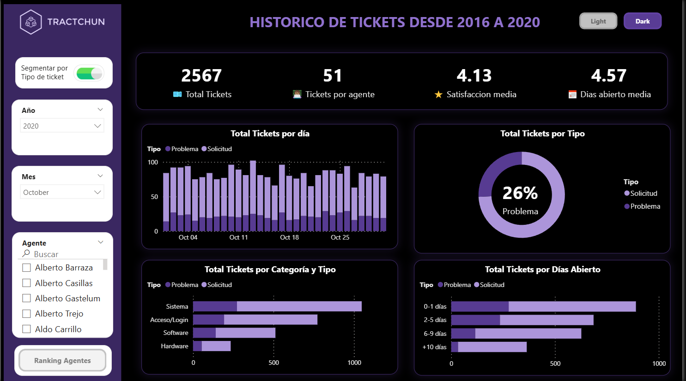

# Tractchun Tickets Dashboard — Power BI Project


**Interactive analytical dashboard** built in **Power BI** to explore historical support ticket data (2016–2020).  
This project visualizes key metrics of **agent performance, customer satisfaction, and service efficiency**, using an intuitive design and dual **Dark/Light themes**.

---

## 📌 Overview

This dashboard allows users to:
- Analyze ticket volume over time by **type**, **priority**, and **status**.
- Evaluate **agent performance** and identify top/low performers.
- Track **customer satisfaction trends** and average resolution times.
- Navigate a visually consistent, user-friendly interface built on design best practices.

---

## 🧠 Core Skills Demonstrated

| Area | Skills |
|------|--------|
| **Data Visualization** | Dashboard design, layout optimization, dark/light theme integration |
| **Power BI Desktop** | DAX measures, calculated fields, data modeling, interactivity |
| **Data Modeling** | Relationship building, star schema design, time intelligence |
| **Analytics & Reporting** | KPIs definition, ranking logic, satisfaction analysis |
| **UX / UI Design** | Hierarchical structure, consistent color palette, clear navigation |
| **Storytelling with Data** | Contextual insights and KPI-driven narratives |

---

## 🧩 Data Model

The project uses a relational model with the following core tables:

- **Tickets:** main fact table with issue details.
- **Agents:** support team data.
- **Categories:** classification of ticket types.
- **Calendar:** date table for time-based analysis.

### 🔗 Relationships
Tickets → Agents

Tickets → Categories

Tickets → Calendar

This structure enables flexible filtering and time-series reporting through DAX measures.

---

## 🖼️ Dashboard Previews

### 🌕 Main View — Light Mode


### 🌑 Main View — Dark Mode


### 🥇 Top Agents Ranking


### 🕓 Lowest Performers


---

## 🗂️ Repository Structure

```
📁 Tractchun-Tickets-Dashboard
│
├── 📄 README.md 
│
├── 📁 /images ← Dashboard screenshots
│ ├── Main_Dark.PNG
│ ├── Main_Light.PNG
│ ├── Ranking_Agentes.PNG
│ ├── Ranking_Ultimos.PNG
│ ├── Segmentar-ON.PNG
│ ├── Segmentar.PNG
│ └── Tractchun+logo.PNG
│
├── 📁 /report
│ └── Tractchun_Reporte.pbix 
│
└── 📁 /data 
  ├── 📁 /Tickets
  │     ├── 2016.xlsx
  │     ├── 2017.xlsx
  │     ├── 2018.xlsx
  │     ├── 2019.xlsx
  │     └── 2020.xlsx  
  ├── Agentes.xlsx
  ├── FotosAgentes.xlsx
  ├── Lista+Empleados.xlsx
  └── Puestos.xlsx

```

---

## ⚙️ How to Use

1. Download or clone the repository:
   ```bash
   git clone https://github.com/juliabeco/Tractchun-Tickets-Dashboard.git
2. Open the file Tractchun_Reporte.pbix in Power BI Desktop.

3. Explore the visuals or connect your own dataset if desired.

4. Switch between Dark and Light themes from the view options.

## 🧾 Author
👩‍💻 Julia Becaria Coquet
📊 Data Analyst | Data Visualization | Power BI | DAX | UX Analytics
📍 Based in Valencia, Spain

[LinkedIn](https://www.linkedin.com/in/julia-becaria-coquet/)

---

💡 This project highlights data storytelling, performance analytics, and advanced Power BI design techniques to deliver actionable insights in a visually compelling way.